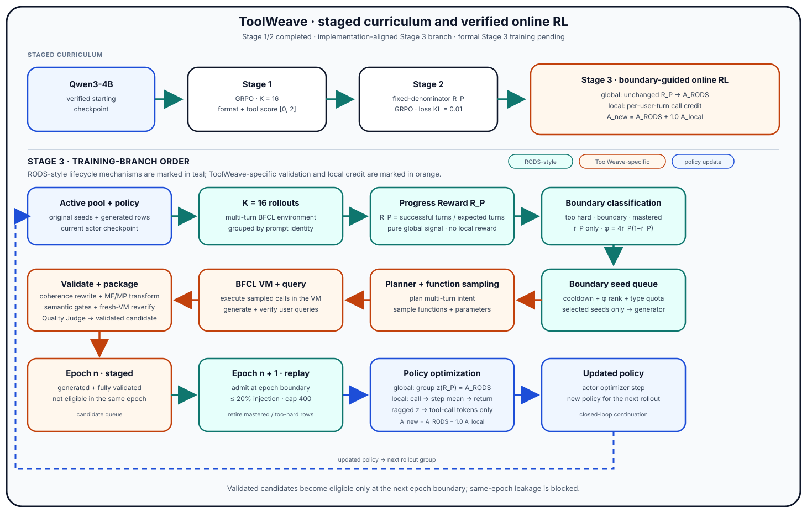
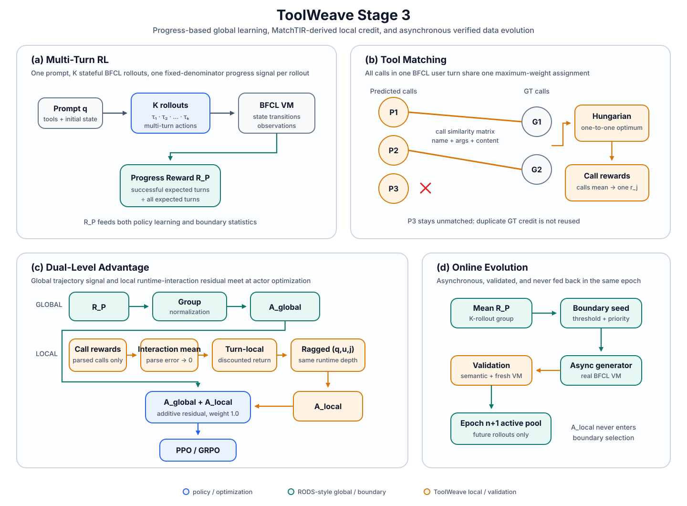

<div align="center">


# ToolWeave

**🧵 Boundary-Guided Verified Tool-Use Synthesis and Agentic Reinforcement Learning for Multi-Turn Tool-Calling Agents.**

ToolWeave trains a multi-turn tool-use policy through a three-stage curriculum, then couples policy optimization with asynchronous, execution-verified data evolution around the current policy's capability boundary.

[](#models)
[](https://github.com/Muradil-mamat-211/ToolWeave)
[](https://www.python.org/)
[](#stage-3-toolweave)
[](#overview)
[](https://github.com/ShishirPatil/gorilla/tree/main/berkeley-function-call-leaderboard)

🤗 [ToolWeave Stage 1 Model](https://huggingface.co/muradil211/ToolWeave_stage1) |
🤗 [ToolWeave Stage 2 Model](https://huggingface.co/muradil211/ToolWeave_stage2) |
🤗 [ToolWeave Stage 3 Model](https://huggingface.co/muradil211/ToolWeave_stage3)

</div>

> [!IMPORTANT]
> ToolWeave is a project-level framework. It is **not** the official RODS or MatchTIR implementation. This README distinguishes public EnvTuning/RODS concepts, MatchTIR-derived local credit, reused BFCL infrastructure, and ToolWeave-specific adaptations and semantic hardening.

## Table of Contents

- [Overview](#overview)
- [Key Results](#key-results)
- [Getting Started](#getting-started)
- [Method](#method)
  - [1. Problem Formulation](#1-problem-formulation)
  - [2. Three-Stage Curriculum](#2-three-stage-curriculum)
- [Stage 3: ToolWeave](#stage-3-toolweave)
  - [3.1 Reward Modeling](#31-reward-modeling)
  - [3.2 Dual-Level Advantage Estimation](#32-dual-level-advantage-estimation)
  - [3.3 Policy Optimization](#33-policy-optimization)
  - [3.4 Boundary-Guided Online Data Evolution](#34-boundary-guided-online-data-evolution)
  - [3.5 Real Rollout Evidence](#35-real-rollout-evidence)
- [Verified Online Data Synthesis](#verified-online-data-synthesis)
- [Detailed Documentation](#detailed-documentation)
- [Models](#models)
- [Data](#data)
- [Repository Layout](#repository-layout)
- [License](#license)
- [Acknowledgements](#acknowledgements)
- [Citation](#citation)

## Overview

Multi-turn tool use has two coupled difficulties. A policy must learn *whether and how* to call tools over a stateful interaction, while the training distribution must continue to expose tasks near the policy's evolving capability boundary. ToolWeave addresses both through a staged curriculum:

1. establish parser-compatible, executable tool use;
2. optimize fixed-denominator multi-turn progress; and
3. combine trajectory-level progress with interaction-level local credit derived from call-level matching, while asynchronously synthesizing verified future training data.

<div align="center">

</div>

Stage 3 deliberately has two non-blocking branches over the same rollout group. The policy branch combines group-normalized $R_P$ with local interaction credit derived from runtime provenance and per-user-turn call matching. The data branch uses grouped $R_P$ only to select boundary seeds, then synthesizes and validates candidates asynchronously for a later epoch. A candidate generated from epoch `n` is never fed back into the current update and is first eligible at epoch `n+1`.

<details>
<summary><b>Method provenance and upstream distinctions</b></summary>

| Source | Role in ToolWeave |
|---|---|
| [EnvTuning](https://arxiv.org/abs/2510.10197) | Multi-turn interaction protocol, public BFCL environment path, and Stage 1 diagnostic semantics |
| [RODS](https://arxiv.org/abs/2606.19047) | Progress Reward, boundary-driven online synthesis, and dynamic-replay concepts |
| [MatchTIR](https://arxiv.org/abs/2601.10712) | Tool-call similarity, one-to-one local matching, and dual-level credit inspiration |
| ToolWeave | BFCL user-turn-local return, ragged same-runtime-depth normalization, additive residual fusion, deterministic semantic hardening, and durable online lifecycle safeguards |

</details>

**Formal-training provenance.** The released Stage 3 checkpoint, the frozen `runtime_interaction_final` implementation selected by the [formal reference profile](stage1_format_rl/configs/layers/profiles/stage3_reference.yaml), and the real K=16 trajectory evidence belong to the confirmed ToolWeave Stage 3 formal-training provenance chain. The current source reproduces the published interaction-credit evidence deterministically; the released model is the final formal Stage 3 checkpoint.

## Key Results

| Stage | Objective | Headline evidence |
|---|---|---|
| Stage 1 | Parser-compatible, executable tool interaction | Update 25 reaches Stage 1 score `1.7007` and parser rate `0.9161` for action positions 2+ on eval-400 |
| Stage 2 | Fixed-denominator task progress | Update 25 reaches $R_P=0.4567$ on the canonical balanced 400-row held-in evaluation set |
| Stage 3 | Dual-level credit with boundary-guided online data evolution | Final checkpoint reaches `48.50` complete-entry BFCL Multi-Turn accuracy (`194 / 400`) on the balanced held-in set |

On the exact Stage 2 fixed-denominator wrapper, Stage 1 update 25 has $R_P=0.3728$ and Stage 2 update 25 has $R_P=0.4567$. The paired difference is `+0.0839`, with a 95% bootstrap interval of `[+0.0536, +0.1146]` over the same 400 sample IDs.

Stage 3 complete-entry accuracy is a different metric from the training-time Progress Reward, and none of these values is presented as an official BFCL leaderboard submission.

**Full experimental and training audit →**
[docs/experiments.md](docs/experiments.md)

## Getting Started

The public repository separates portable source/configuration from machine-local models, datasets, outputs, and credentials. Use Python 3.10+ with the project runtime dependencies already installed; the repository does not currently provide a one-command environment bootstrap.

1. Clone the repository and create an ignored local environment file:

   ```bash
   git clone https://github.com/Muradil-mamat-211/ToolWeave.git
   cd ToolWeave
   cp environment/env.template.sh environment/env.local.sh
   ```

2. Edit `environment/env.local.sh` so `TOOLWEAVE_ASSET_ROOT`, `TOOLWEAVE_DATA_ROOT`, and `TOOLWEAVE_PYTHON` point to your local assets and compatible Python environment, then load it:

   ```bash
   source environment/env.local.sh
   ```

   The exact required model/data files and hashes are declared in the [Stage 3 asset layer](stage1_format_rl/configs/layers/assets/stage3_reference.yaml). Upstream datasets and released model links are listed in [Data](#data) and [Models](#models).

3. Resolve and validate the formal Stage 3 reference profile:

   ```bash
   python -m stage1_format_rl.infrastructure.cli \
     --profile stage1_format_rl/configs/layers/profiles/stage3_reference.yaml \
     resolve

   python -m stage1_format_rl.infrastructure.cli \
     --profile stage1_format_rl/configs/layers/profiles/stage3_reference.yaml \
     preflight --check-assets --observe-hardware
   ```

4. Inspect the generated launch without starting training:

   ```bash
   python -m stage1_format_rl.infrastructure.cli \
     --profile stage1_format_rl/configs/layers/profiles/stage3_reference.yaml \
     launch
   ```

   `launch` is a dry run by default. Execution is intentionally explicit and guard-protected:

   ```bash
   ALLOW_RODS_MATCHTIR_STAGE3_TRAINING=1 \
   python -m stage1_format_rl.infrastructure.cli \
     --profile stage1_format_rl/configs/layers/profiles/stage3_reference.yaml \
     launch --execute
   ```

The reference profile targets the audited 2×96 GiB topology. Hardware, runtime placement, assets, algorithm settings, and qualification requirements remain separate layers; see the [layered configuration guide](stage1_format_rl/configs/layers/README.md) and [infrastructure documentation](docs/infrastructure-decoupling.md).

## Method

### 1. Problem Formulation

Let `q` denote one BFCL prompt. The current policy produces a group of `K` multi-turn rollouts,

$$
\mathcal{T}_q=\lbrace\tau_i\rbrace_{i=1}^{K}.
$$

Each rollout contains several distinct levels. Keeping them separate is essential to the method:

| Level | Symbol | Meaning |
|---|---|---|
| Prompt | $q$ | One BFCL sample and its initial environment/tool contract |
| Rollout | $\tau_i$ | One sampled stateful interaction for prompt $q$ |
| BFCL user turn | $u$ | One expected user task inside the multi-turn sample |
| Non-answer runtime interaction | $j\in\mathcal{D}_{i,u}$ | One assistant generation followed by parser/environment handling, before valid answer/turn closure |
| Parsed calls | $P_{i,u,j}$ | Successfully parsed structured calls in runtime interaction $j$; empty when no structured calls are parsed |
| User-turn call sequence | $P_{i,u}$ | All successfully parsed calls across the non-answer runtime interactions of user turn $u$ |
| Ground-truth calls | $G_u$ | The expected executable calls for user turn $u$ |
| Observation | $o_{i,u,j+1}$ | The parser/environment feedback produced after runtime interaction $j$ |

The formal local sequence and its domain are

$$
\mathcal{I}_{i,u}=(I_{i,u,j})_{j\in\mathcal{D}_{i,u}},
\qquad
\mathcal{D}_{i,u}=\mathrm{dom}(\mathcal{I}_{i,u})=\lbrace 0,\ldots,J_{i,u}-1\rbrace.
$$

The complete predicted-call sequence for a user turn is the duplicate-preserving concatenation

$$
P_{i,u}=\biguplus_{j\in\mathcal{D}_{i,u}}P_{i,u,j}.
$$

A valid final answer/turn closure is excluded from $\mathcal{D}_{i,u}$ and receives global credit only. Every temporally reliable non-answer runtime interaction remains in the local sequence, including parser-rejected or unclassified malformed actions. The historical `tool_attempt_index` field is retained only as diagnostic metadata; it does not control matching, discount distance, peer grouping, normalization, advantage alignment, or token broadcast. ToolWeave matches at the **individual-call** level, accumulates temporal credit at the **runtime-interaction** level, and applies policy gradients at the **trainable actor-token** level.

### 2. Three-Stage Curriculum

#### Stage 1 — Tool-Use Cold Start

Stage 1 starts from `Qwen/Qwen3-4B` and uses the public EnvTuning interaction path to establish strict response formatting and executable tool calls.

##### Diagnostic Event Semantics

The runtime emits one diagnostic event for each assistant action or closed BFCL user turn:

| Code | Runtime meaning | Terminal? | Stage 1 role | Stage 2/3 role |
|---:|---|:---:|---|---|
| `-3` | Response/action fails the required parser/format protocol before a valid tool execution | No | Format failure contributing to $F_i$ | Intermediate diagnostic only |
| `-2` | A parsed tool call reaches execution but the BFCL VM reports an execution failure | No | Failed executed-call event contributing to the $Q_i$ denominator | Intermediate diagnostic only |
| `-1` | A parsed tool call executes without an execution error | No | Successful executed-call event contributing to the $Q_i$ numerator | Intermediate diagnostic only; **not** terminal task success |
| `0` | Current BFCL user turn closes unsuccessfully | Yes | Terminal diagnostic; not a successful tool-execution event | Terminal failure |
| `1` | Current BFCL user turn closes successfully | Yes | Terminal diagnostic | Terminal success and $R_P$ numerator event |

> [!IMPORTANT]
> Code `-1` means **execution success, not semantic task success**. A tool call may be syntactically valid and execute without a VM error, therefore emitting `-1`, while still being task-incorrect and later terminating the BFCL user turn with `0`.

Only terminal codes `0` and `1` determine BFCL user-turn completion. The Stage 2/3 fixed-denominator Progress Reward ignores `-3`, `-2`, and `-1` in both its numerator and denominator.

For rollout $i$, let $C_i$ be its diagnostic-code sequence, $T_i=|C_i|$, and $n_{i,c}$ the count of code $c$. Define

$$
I_i^{\mathrm{tool}}=\mathbf{1}[n_{i,-1}+n_{i,-2}>0],
\qquad
F_i=\frac{T_i-n_{i,-3}}{T_i},
$$

$$
Q_i=
\begin{cases}
\dfrac{n_{i,-1}}{n_{i,-1}+n_{i,-2}}, & I_i^{\mathrm{tool}}=1,\\
0, & \text{otherwise},
\end{cases}
\qquad
S_i^{\mathrm{Stage1}}=I_i^{\mathrm{tool}}(F_i+Q_i).
$$

The Stage 1 score lies in `[0,2]`. It measures parser-compatible behavior and executable attempted calls; it is not a fixed-denominator task-completion rate. Empty denominators return zero. The scalar score is group-normalized across the 16 rollouts of each prompt. This stage uses the audited reward-side adaptive KL controller (`initial beta = 0.1`, target `0.1`, horizon `10,000`).

ToolWeave's diagnostic-code semantics follow the public EnvTuning implementation used by this project. Where downstream prose is ambiguous, the executable upstream implementation is treated as the implementation reference.

#### Stage 2 — Progress-Reward Learning

Stage 2 begins from Stage 1 update 25 and replaces the cold-start score with the RODS fixed-denominator Progress Reward. For non-empty-GT turns, terminal success requires the applicable BFCL state and response checks to pass. Empty-GT Missing Function and Missing Parameter turns follow the explicit no-call/answer protocol. In either case, the reward wrapper ultimately receives terminal code `1` for success and `0` for failure. The reward is

$$
R_P^{(i)}=
\frac{1}{U_i}
\sum_{u=1}^{U_i}
\mathbf{1}[\text{user turn }u\text{ succeeds in }\tau_i].
$$

$U_i$ is the number of expected BFCL user turns. Missing terminal outcomes, truncation, and early termination remain failures in the denominator. A zero expected-turn denominator returns zero, while more terminal outcomes than the GT contract permits raise an error. Stage 2 uses $R_P$ as its only global reward, disables reward-side KL, and applies the audited loss-side `low_var_kl` reference term with coefficient `0.01`.

#### Stage 3 — Boundary-Guided Fine-Grained Online RL

Stage 3 retains the same global Progress Reward and adds a MatchTIR-derived local residual over the ordered non-answer runtime-interaction timeline. In parallel, grouped $R_P$ statistics drive boundary selection and asynchronous verified synthesis. Local credit changes neither $R_P$ nor the boundary selector.

| Stage | Starting model | Primary signal | Data behavior |
|---|---|---|---|
| Stage 1 | `Qwen/Qwen3-4B` | Format + executable-call score | Fixed 100-row Base training split |
| Stage 2 | Stage 1 update 25 | Fixed-denominator $R_P$ | Same fixed 100-row Base split |
| Stage 3 | Stage 2 update 25 | $A^{g}+A^{\ell}$ in the actor update | 400 original rows plus next-epoch validated candidates |

## Stage 3: ToolWeave

<div align="center">

</div>

For a rollout $\tau_i$, ToolWeave uses the following consistent notation:

| Quantity | Meaning |
|---|---|
| $R_P^{(i)}$ | Scalar fixed-denominator Progress Reward |
| $A_i^{g}$ | Group-normalized global advantage for rollout $i$ |
| $r_{i,u,j}$ | Local reward of non-answer runtime interaction $j$ in BFCL user turn $u$ |
| $R_{i,u,j}^{\ell}$ | User-turn-local discounted return over real runtime depth |
| $A_{i,u,j}^{\ell}$ | Ragged same-runtime-depth normalized local advantage |
| $A_{i,u,j}^{TW}$ | Fused ToolWeave advantage used on actor tokens belonging to runtime interaction $j$ |

Throughout the public method description, $j$ denotes the real non-answer runtime-interaction depth. The canonical public advantage notation is $A^g$, $A^{\ell}$, and $A^{TW}$. Implementation compatibility fields and legacy provenance aliases are documented separately in [Implementation Notes](docs/implementation-notes.md).

This is the frozen ToolWeave Stage-3 formal-training credit-assignment algorithm.

### 3.1 Reward Modeling

#### Global Task Reward

MatchTIR combines process-level interaction reward with a final-answer outcome term. ToolWeave does **not** use MatchTIR's final-answer F1 as its global task reward. Its only global task reward is the RODS Progress Reward $R_P^{(i)}$ defined above. Local matching quantities never enter $R_P$.

#### Tool-Call Matching Matrix

For predicted call $p$ and GT call $g$, first define a tool-name score:

$$
S_{\mathrm{tn}}(p,g)=
\begin{cases}
1, & p,g\text{ are valid and their function names match case-insensitively},\\
0, & \text{otherwise}.
\end{cases}
$$

Let $N_p$ and $N_g$ be the predicted and GT argument-name collections. MatchTIR's paper defines the parameter-name component with ordinary set Jaccard:

$$
S_{\mathrm{pn}}^{\mathrm{paper}}(p,g)=
\frac{|\mathrm{set}(N_p)\cap\mathrm{set}(N_g)|}
{|\mathrm{set}(N_p)\cup\mathrm{set}(N_g)|}.
$$

ToolWeave's audited implementation instead follows the upstream-code-compatible `Counter`-based **multiset** form. For multiplicity count $C_N(x)$,

$$
I_{\mathrm{multi}}(N_p,N_g)=
\sum_x \min(C_{N_p}(x),C_{N_g}(x)),
$$

$$
S_{\mathrm{pn}}(p,g)=
\frac{I_{\mathrm{multi}}(N_p,N_g)}
{|N_p|+|N_g|-I_{\mathrm{multi}}(N_p,N_g)}.
$$

When both argument-name collections are empty, the implementation returns $S_{\mathrm{pn}}=1$. Because canonical structured arguments are mappings, valid calls normally have unique argument keys. For such canonical inputs, the multiset form reduces to ordinary set Jaccard. The distinction is retained here to document the audited implementation exactly.

The parameter-content component counts exact structured equality only over GT argument keys:

$$
S_{\mathrm{pc}}(p,g)=
\sum_{k\in N_g}
\mathbf{1}[k\in N_p\ \text{and}\ p_k=g_k].
$$

The final ToolWeave call similarity is

$$
S(p,g)=
S_{\mathrm{tn}}(p,g)
\frac{S_{\mathrm{tn}}(p,g)+S_{\mathrm{pn}}(p,g)+S_{\mathrm{pc}}(p,g)}{2+|N_g|}.
$$

Invalid calls and function-name mismatches therefore score zero. Parameter values are compared after conversion to stable JSON-compatible built-ins; no fuzzy value matching is introduced.

> **Paper/implementation distinction.** MatchTIR's paper uses set Jaccard for parameter names. ToolWeave documents and executes the multiset form found in the audited source path; the README does not silently replace implementation behavior with the paper equation.

#### Hard Bipartite Assignment

For one rollout and one BFCL user turn, let $m=|P_{i,u}|$, $n=|G_u|$, and form the complete matrix

$$
\mathbf{S}\in\mathbb{R}^{m\times n},
\qquad
\mathbf{S}_{ab}=S(p_a,g_b).
$$

ToolWeave solves the maximum-weight one-to-one assignment

$$
\max_{x}\sum_{a=1}^{m}\sum_{b=1}^{n}x_{ab}\mathbf{S}_{ab},
$$

subject to

$$
x_{ab}\in\lbrace 0,1\rbrace,
\qquad
\sum_b x_{ab}\le 1,
\qquad
\sum_a x_{ab}\le 1.
$$

The call reward is

$$
r_{p_a}=
\begin{cases}
\mathbf{S}_{ab}, & x_{ab}=1\text{ and }\mathbf{S}_{ab}>0,\\
0, & \text{otherwise}.
\end{cases}
$$

The implementation uses `unmatched_penalty = 0.0`. One-to-one assignment prevents duplicate predicted calls from repeatedly claiming the same GT call, which independent per-call maxima would allow.

#### Call-Level Reward to Interaction Reward

A single runtime interaction may contain more than one parsed call. Individual-call rewards are averaged back to that one interaction:

$$
r_{i,u,j}=
\begin{cases}
\dfrac{1}{|P_{i,u,j}|}\displaystyle\sum_{p\in P_{i,u,j}}r_p,
& |P_{i,u,j}|>0,\\
0, & |P_{i,u,j}|=0.
\end{cases}
$$

Only successfully parsed calls participate in matching. Any unparsed non-answer runtime interaction therefore remains one temporal step with $P_{i,u,j}=\varnothing$ and $r_{i,u,j}=0$. A successfully parsed call remains in matching even if its later environment execution fails: the local branch measures tool-call semantic correctness, while the global Progress Reward measures stateful task success. Multiple calls inside one action are never converted into multiple temporal steps.

This matching and interaction-return construction applies to BFCL user turns with a non-empty executable ground-truth call structure $G_u$. When $G_u=\varnothing$, the local branch abstains: $A_{i,u,j}^{\ell}=0$, and actor tokens remain global-only. ToolWeave does not invent a local clarification or final-answer reward for empty-GT turns.

### 3.2 Dual-Level Advantage Estimation

#### Global Advantage

For the $K$ rollouts sampled from the same prompt, ToolWeave computes the unchanged GRPO advantage from $R_P$:

$$
\mu_q^g=\frac{1}{K}\sum_{k=1}^{K}R_P^{(k)},
$$

$$
\sigma_q^g=
\sqrt{
\frac{1}{K-1}
\sum_{k=1}^{K}
\left(R_P^{(k)}-\mu_q^g\right)^2
},
$$

$$
A_i^g=
\frac{R_P^{(i)}-\mu_q^g}{\sigma_q^g+\epsilon},
\qquad \epsilon=10^{-6}.
$$

This scalar is the trajectory-level signal and is shared by trainable actor tokens under the existing response/loss mask. The notation $A^g$ avoids implying that RODS defines a separately named advantage estimator.

#### Local Discounted Return

Within one BFCL user turn $u$, rewards are accumulated backward over the complete non-answer runtime-interaction sequence:

$$
R_{i,u,j}^{\ell}=
\sum_{h=j}^{J_{i,u}-1}
\gamma^{h-j}r_{i,u,h},
\qquad \gamma=0.9.
$$

> **ToolWeave adaptation.** Parser-rejected and otherwise unparsed non-answer interactions remain real discount steps at $r=0$; they are never deleted before computing the return. The accumulator resets at the next BFCL user turn, so local reward never propagates across that boundary. A valid final answer/turn closure is excluded rather than appended as a zero-reward local step.

#### Ragged Same-Runtime-Depth Normalization

Different rollouts can contain different numbers of non-answer runtime interactions. Define

$$
\mathcal{D}_{i,u}=\mathrm{dom}(\mathcal{I}_{i,u})=\lbrace 0,\ldots,J_{i,u}-1\rbrace,
$$

and the ragged same-runtime-depth peer set

$$
\mathcal{S}_{q,u,j}=
\left\lbrace
i\in\lbrace 1,\ldots,K\rbrace
:
j\in\mathcal{D}_{i,u}
\right\rbrace.
$$

Peer membership depends only on actual interaction existence at the same prompt, user turn, and runtime depth. Missing late interactions are absent, not zero-valued samples. Let

$$
n_{q,u,j}=|\mathcal{S}_{q,u,j}|.
$$

For $n_{q,u,j}\ge 2$, define

$$
\mu_{q,u,j}^{\ell}=
\frac{1}{n_{q,u,j}}
\sum_{i\in\mathcal{S}_{q,u,j}}R_{i,u,j}^{\ell},
$$

$$
s_{q,u,j}^{\ell}=
\sqrt{
\frac{1}{n_{q,u,j}-1}
\sum_{i\in\mathcal{S}_{q,u,j}}
\left(R_{i,u,j}^{\ell}-\mu_{q,u,j}^{\ell}\right)^2
},
$$

The local advantage is defined for every support size by

$$
A_{i,u,j}^{\ell}=
\frac{R_{i,u,j}^{\ell}-\mu_{q,u,j}^{\ell}}
{s_{q,u,j}^{\ell}+\epsilon}
\quad
\text{when }n_{q,u,j}\ge 2\text{ and }0<s_{q,u,j}^{\ell}<\infty,
\qquad \epsilon=10^{-6}.
$$

Otherwise,

$$
A_{i,u,j}^{\ell}=0.
$$

$s_{q,u,j}^{\ell}$ is the unbiased sample standard deviation and is defined only for support of at least two. The implementation key is `(uid, user_turn_id, runtime_interaction_index)`. `tool_attempt_index` never enters discounting, peer grouping, normalization, or advantage alignment.

### 3.3 Policy Optimization

The core Stage 3 advantage is

$$
\boxed{A_{i,u,j}^{TW}=A_i^g+\lambda_{\mathrm{local}}A_{i,u,j}^{\ell}}
\qquad \lambda_{\mathrm{local}}=1.0.
$$

For a token inside an actor-span-reliable non-answer runtime interaction, the actor uses $A_i^g+A_{i,u,j}^{\ell}$. Every other trainable actor token uses $A_i^g$. There is no divide-by-two fusion, post-fusion normalization, RMS rescaling, or adaptive local weighting.

#### Token Assignment

The local scalar is broadcast over the trainable actor tokens inside the originating runtime-interaction assistant span, intersected with the existing actor response/loss mask. This includes parser-rejected or unclassified malformed non-answer generations when temporal identity and actor span are reliable. ToolWeave does **not** define a finer per-call JSON-token-subspan objective. User messages, tool observations, environment tokens, and other non-actor positions receive zero local residual, and the implementation asserts that local values cannot leak outside the actor mask.

#### Core Local-Credit Invariants

1. An unparsed non-answer runtime interaction has $P_{i,u,j}=\varnothing$ and $r_{i,u,j}=0$, but remains in the temporal chain.
2. A valid final answer or turn closure is excluded from the local chain; answer actor tokens receive global-only credit.
3. For empty GT, $A^{\ell}=0$; no local clarification or final-answer reward is invented.
4. For ragged peer support below 2, or zero/non-finite sample standard deviation, $A^{\ell}=0$.

**Full implementation and fail-closed contract →**
[docs/implementation-notes.md](docs/implementation-notes.md)

#### PPO/GRPO Actor Update

The fused advantage is passed to the existing actor-only PPO/GRPO path. For actor-token position $z$,

$$
\rho_{i,z}=
\exp\left(
\log\pi_{\theta}(a_{i,z})-
\log\pi_{\mathrm{old}}(a_{i,z})
\right),
$$

$$
\ell_{i,z}^{(1)}=-A_{i,z}^{TW}\rho_{i,z},
\qquad
\ell_{i,z}^{(2)}=
-A_{i,z}^{TW}
\mathrm{clip}(\rho_{i,z},1-\epsilon_{\mathrm{low}},1+\epsilon_{\mathrm{high}}).
$$

The unchanged implementation applies the configured clipped/dual-clipped surrogate, response mask, reference KL, backward pass, and optimizer step. Local credit is not added to reward-side KL or to boundary statistics.

Exact clipping, KL, aggregation, and tensor-contract details are documented in [Implementation Notes](docs/implementation-notes.md#ppo--grpo-implementation-contract).

### 3.4 Boundary-Guided Online Data Evolution

The same $K$ rollout rewards also produce a prompt-level mean

$$
\bar r_P(q)=\frac{1}{K}\sum_{i=1}^{K}R_P^{(i)}.
$$

RODS-style capability regions are

| Region | Rule |
|---|---|
| Too hard | $\bar r_P(q)<0.20$ |
| Boundary | $0.20\le\bar r_P(q)\le0.85$ |
| Mastered | $\bar r_P(q)>0.85$ |

Boundary examples are prioritized by

$$
\phi(q)=4\bar r_P(q)\left(1-\bar r_P(q)\right).
$$

After a sample-identity cooldown, candidates are partitioned into Base, Missing Function, Missing Parameter, and Long Context buckets. Each bucket is ranked by descending $\phi$, limited by its quota $M_{\tau}$, and bounded by total budget $M$, with

$$
\sum_{\tau}M_{\tau}=M.
$$

There is no quota redistribution when one type has too few eligible samples. The paper specifies the mechanism but does not publish one unique numeric default for $M$, $M_{\tau}$, or cooldown $c$; ToolWeave's formal training configuration supplies these project hyperparameters explicitly, and validation fails fast if they are omitted.

ToolWeave formal training fixes these project choices to

$$
M=16,
\qquad
M_{\tau}=4
\quad \forall \tau\in
\lbrace
\mathrm{Base},\mathrm{MF},\mathrm{MP},\mathrm{LC}
\rbrace,
\qquad
c=13.
$$

These are ToolWeave project hyperparameters and are not attributed to RODS. The four per-type quotas sum exactly to the total selection budget.

This branch consumes only $R_P$. It never consumes $A^{\ell}$, call similarities, or the fused advantage. Seed dispatch occurs after a successful optimizer update, and the separate generator proceeds asynchronously while policy learning can continue.

Validated candidates generated in epoch `n` are staged and become eligible only at epoch `n+1`. The complete generated-pool lifecycle and edge behavior are preserved in the [online data-evolution audit](docs/online-data-evolution.md#boundary-guided-lifecycle).

### 3.5 Real Rollout Evidence

#### Why trajectory-only credit is insufficient

A trajectory-only estimator assigns the same global signal to every interaction in one rollout:

$$
A_{i,u,j}^{\mathrm{trajectory}}=A_i^g.
$$

It can distinguish which rollout was better overall, but it cannot distinguish strong and weak interactions inside the same globally successful or failed trajectory.

#### ToolWeave's solution

ToolWeave adds the runtime-interaction-level local residual:

$$
A_{i,u,j}^{TW}
=
A_i^g+A_{i,u,j}^{\ell}.
$$

The local residual allows interactions inside one rollout to receive different fused advantages. In the real special-recovery rollout for User Turn 3, five parser-rejected actions remain explicit zero-reward temporal steps before one valid two-call action:

```text
Special recovery rollout
j=0...4  unparsed/parser-rejected interactions  r=0
j=5      one valid two-call action              r=1
         ticket_login, create_ticket
```

#### Real K=16 evidence

| Real behavior | Global $A^g$ | Local $A^{\ell}$ | Fused $A^{TW}$ effect |
|---|:---:|:---:|---|
| Efficient + globally successful | + | + | Strengthens efficient, correct interactions |
| Globally successful but locally weaker | + | - | Can become negative for the weaker interaction |
| Locally correct but globally failed | - | + | Remains negative here, but is softened by correct local evidence |
| Repeated parser failures followed by recovery | - | early strong -, late singleton 0 | Makes supported early errors more negative; the final correction remains global-only |

$A^g$ is rollout-level, while $A^{\ell}$ is runtime-interaction-level. These are relative advantages, so fused signs need not equal binary correctness labels. At singleton late depths the local estimator abstains with $A^{\ell}=0$ rather than fabricating peer credit.

This deterministic formal-training group demonstrates finer credit resolution than trajectory-only supervision. It is evidence about credit-assignment behavior, not by itself a controlled claim of superior final-policy performance.

**Full deterministic K=16 formal-training audit →**
[docs/credit-assignment-audit.md](docs/credit-assignment-audit.md)

**Trajectory and reproducible group artifacts:** [Hugging Face dataset](https://huggingface.co/datasets/muradil211/ToolWeave-BFCL-Rollout-Case-Study)

## Verified Online Data Synthesis

The Data-Generation Branch is a separate queue consumer: it does not redo boundary selection or block the current optimizer step.

1. **Boundary seed selection.** The Training Branch emits validated `rods_boundary_seed.v1` records selected from grouped $R_P$ statistics.
2. **Planning and function construction.** A RODS-derived planner proposes an executable structure using the audited active function catalog and schema-grounded parameters.
3. **Real BFCL VM execution.** Ground truth is generated and executed before query writing; eligible failures drive deterministic repair, blocklisting, and bounded replanning.
4. **Query and conversation construction.** Executed turns become class-conditioned user queries, followed by a whole-conversation rewrite that preserves executable intent and Missing Function/Parameter protocols.
5. **Semantic hardening.** ToolWeave-specific deterministic guards enforce argument provenance, units, unambiguous relations, genuine missing information, observation entailment, action minimality, recursive result semantics, and exact-content novelty.
6. **Fresh-VM validation, judge, and admission.** Candidates must pass fresh-state replay, tool-visibility and complexity gates, the Quality Judge, the frozen schema, and the Training Branch validator before durable publication.

> [!IMPORTANT]
> A candidate generated in epoch `n` is **not** consumed in the same epoch and becomes eligible no earlier than epoch `n+1`.

Boundary-driven planning, executable interaction, query construction, critique/refinement, and dynamic replay are RODS-inspired concepts. The deterministic semantic-hardening and durable lifecycle safeguards are ToolWeave-specific adaptations; the reconstructed branch is not presented as official RODS source code.

**Full online data-evolution and verified-synthesis audit →**
[docs/online-data-evolution.md](docs/online-data-evolution.md)

## Detailed Documentation

| Document | Scope |
|---|---|
| [Credit-Assignment Audit](docs/credit-assignment-audit.md) | Full deterministic K=16 formal-training evidence |
| [Experiments](docs/experiments.md) | Complete Stage 1/2/3 evaluation and training audit |
| [Online Data Evolution](docs/online-data-evolution.md) | Full verified-synthesis and lifecycle details |
| [Implementation Notes](docs/implementation-notes.md) | Runtime/provenance compatibility, local-credit fail-closed invariants, and PPO/GRPO implementation contract |
| [Data & Trajectory Anatomy](docs/data-and-trajectories.md) | BFCL runtime hierarchy and trajectory examples |
| [Infrastructure Decoupling](docs/infrastructure-decoupling.md) | Portable configuration and runtime separation |

See the [documentation index](docs/README.md) for the complete map.

## Models

| Model | Stage | Description | Status | Link |
|---|---|---|---|---|
| `ToolWeave_stage1` | Stage 1 | Selected merged update-25 checkpoint after the Stage 1 gate | Public selected checkpoint | [Hugging Face](https://huggingface.co/muradil211/ToolWeave_stage1) |
| `ToolWeave_stage2` | Stage 2 | Selected merged update-25 checkpoint initialized from Stage 1 update 25 | Public selected checkpoint | [Hugging Face](https://huggingface.co/muradil211/ToolWeave_stage2) |
| `ToolWeave_stage3` | Stage 3 | Final checkpoint after formal boundary-guided interaction-aware online reinforcement learning | Final ToolWeave Stage 3 model | [Hugging Face](https://huggingface.co/muradil211/ToolWeave_stage3) |

The model links do not imply that the full reproducibility package has already been released. The Stage 3 link points to the completed final ToolWeave Stage 3 model.

## Data

ToolWeave does not rehost the upstream BFCL/EnvTuning datasets; canonical upstream sources are linked below.

**Trajectory anatomy.** See [Data & Trajectory Anatomy](docs/data-and-trajectories.md) for the BFCL sample → user turn → non-answer runtime interaction → parsed-call hierarchy and a real parser-recovery rollout.

| Resource | Composition and role | Source |
|---|---|---|
| Stage 1/2 training | 100 Base interaction rows | [AWorld-RL `bfcl_train_base.parquet`](https://github.com/inclusionAI/AWorld-RL/blob/main/EnvTuning/data/bfcl_train_base.parquet) |
| Stage 3 original pool | 400 rows: 100 per BFCL multi-turn category | [AWorld-RL `bfcl_train.parquet`](https://github.com/inclusionAI/AWorld-RL/blob/main/EnvTuning/data/bfcl_train.parquet) |
| Held-in evaluation | 400 rows: 100-row validation + 300-row test | [`bfcl_val.parquet`](https://github.com/inclusionAI/AWorld-RL/blob/main/EnvTuning/data/bfcl_val.parquet) + [`bfcl_test.parquet`](https://github.com/inclusionAI/AWorld-RL/blob/main/EnvTuning/data/bfcl_test.parquet) |
| Original benchmark source | BFCL V3 Multi-Turn | [BFCL dataset](https://huggingface.co/datasets/gorilla-llm/Berkeley-Function-Calling-Leaderboard) and [repository data](https://github.com/ShishirPatil/gorilla/tree/main/berkeley-function-call-leaderboard/bfcl_eval/data) |
| Generated Stage 3 candidates | Execution- and semantics-validated online replay rows | Formal-training project artifact; separate data release not included here |

These parquet rows provide prompts, tools, environment metadata, and reward-side GT for executable RL interaction; ToolWeave does not describe them as supervised trajectory-imitation data.

RODS describes an 800-row BFCL V3 Multi-Turn in-distribution protocol: 400 training rows (100 per category) and 400 held-in evaluation rows (100 per category). In the public AWorld-RL processed layout, the held-in IDs are the union of the 100-row validation and 300-row test files above. The separate local RODS-style audit subset has 100 rows (25 per category); it is not the canonical Stage 1/2 eval-400 used in the reported comparison.

Exact prepared-dataset identities and SHA256 hashes used by the audited runs are recorded in the [Experiments and Training Audit](docs/experiments.md#audited-local-training-dataset-identities).

## Repository Layout

```text
ToolWeave/
├── .env.example
├── README.md
├── ALGORITHM_REPORT_STAGE3_RUNTIME_INTERACTION_CREDIT_FINAL.md
├── assets/                         # Project marks and method figures
├── code/
│   └── AWorld-RL-stage1-worktree/
│       └── EnvTuning/              # Public interaction, credit, trainer, and generator source
├── configs/                        # Historical standalone configuration examples
├── docs/
│   ├── README.md                   # Documentation index
│   ├── credit-assignment-audit.md  # Complete deterministic K=16 audit
│   ├── experiments.md              # Full evaluation and training audit
│   ├── online-data-evolution.md    # Verified synthesis and lifecycle audit
│   ├── implementation-notes.md     # Runtime and optimizer implementation contract
│   ├── data-and-trajectories.md    # BFCL runtime and trajectory anatomy
│   └── infrastructure-decoupling.md # Portable runtime/configuration audit
├── environment/                    # Machine-local configuration templates
├── scripts/                        # Data, evaluation, and audit utilities
└── stage1_format_rl/
    ├── configs/layers/
    │   └── profiles/stage3_reference.yaml
    ├── infrastructure/             # Layer resolver, preflight, and launch CLI
    ├── rewards/
    ├── schemas/
    └── tests/
```

Root [`configs/`](configs/) retains standalone historical examples. The formal portable launch contract lives under [`stage1_format_rl/configs/layers/`](stage1_format_rl/configs/layers/), where experiment, asset, hardware, runtime, and qualification concerns are resolved independently.

## License

ToolWeave currently has no root project-level `LICENSE` file. The repository is source-visible, but no project-wide reuse grant should be inferred from visibility alone. Adapted or vendored upstream components remain subject to their own terms, including [AWorld-RL's MIT license](https://github.com/inclusionAI/AWorld-RL/blob/main/LICENSE), the vendored [veRL Apache-2.0 license](code/AWorld-RL-stage1-worktree/EnvTuning/verl/LICENSE), and [BFCL/Gorilla's Apache-2.0 license](https://github.com/ShishirPatil/gorilla/blob/main/LICENSE). A root ToolWeave license should be added only after the project owner completes the upstream compatibility and notice review.

## Acknowledgements

ToolWeave builds on and adapts ideas or public infrastructure from the following projects. Their authors and teams are not implied to be contributors to ToolWeave.

- [AWorld-RL](https://github.com/inclusionAI/AWorld-RL)
- [Environment Tuning](https://github.com/inclusionAI/AWorld-RL/tree/main/EnvTuning) and its [paper](https://arxiv.org/abs/2510.10197)
- [RODS](https://github.com/inclusionAI/AWorld-RL/tree/main/RODS) and its [paper](https://arxiv.org/abs/2606.19047)
- [MatchTIR](https://github.com/quchangle1/MatchTIR) and its [paper](https://arxiv.org/abs/2601.10712)
- [BFCL](https://github.com/ShishirPatil/gorilla/tree/main/berkeley-function-call-leaderboard)
- [veRL](https://github.com/volcengine/verl)
- [Qwen](https://huggingface.co/Qwen/Qwen3-4B)

## Citation

A formal ToolWeave citation will be added with the public technical report. Please cite the original upstream work when using its concepts or infrastructure.

### RODS

```bibtex
@article{fang2026rods,
  title={RODS: Reward-Driven Online Data Synthesis for Multi-Turn Tool-Use Agents},
  author={Fang, Ruishan and Lu, Siyuan and Zhuang, Chenyi and Lin, Tao},
  journal={arXiv preprint arXiv:2606.19047},
  year={2026}
}
```

### MatchTIR

```bibtex
@article{qu2026matchtir,
  title={MatchTIR: Fine-Grained Supervision for Tool-Integrated Reasoning via Bipartite Matching},
  author={Qu, Changle and Dai, Sunhao and Cai, Hengyi and Xu, Jun and Wang, Shuaiqiang and Yin, Dawei},
  journal={arXiv preprint arXiv:2601.10712},
  year={2026}
}
```

### Environment Tuning

```bibtex
@article{lu2025don,
  title={Don't Just Fine-tune the Agent, Tune the Environment},
  author={Lu, Siyuan and Wang, Zechuan and Zhang, Hongxuan and Wu, Qintong and Gan, Leilei and Zhuang, Chenyi and Gu, Jinjie and Lin, Tao},
  journal={arXiv preprint arXiv:2510.10197},
  year={2025}
}
```
