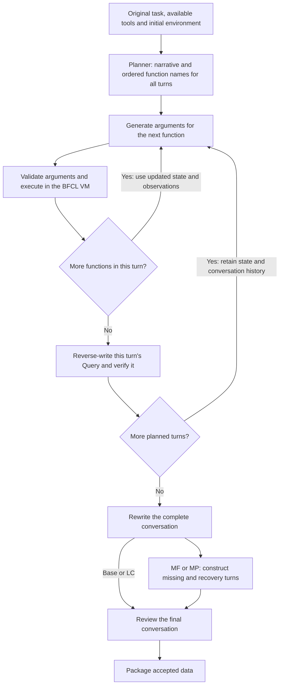

# Second synthesis method: Codex CLI

ToolWeave provides another data-construction method through the official
`codex exec` CLI with an existing ChatGPT login. Python coordinates the generation
roles and executes tool calls in the BFCL VM. The Codex backend uses no direct
LLM API or SDK calls.

## Construction framework

**Planner plans the whole task → build each turn by generating function
arguments and immediately executing each call in the VM, then reverse-write
that turn's Query → rewrite the complete conversation → apply MP/MF
transformations → review the final conversation → package the data.**



| Role | Input | Output |
| --- | --- | --- |
| Planner | Original Queries and reference GT, source tool definitions and restoration events, initial environment, category and budgets | Task narrative and ordered function names for every planned turn |
| Parameter Generator | Current function schema, narrative, latest VM state and successful execution history | Arguments for one function |
| BFCL VM | Concrete function call | Actual observation and updated state |
| Query Generator | Current turn's successful calls and observations, preceding Queries and execution history, narrative | One natural user Query |
| Query Verifier | Query and execution evidence for the turn | Accept or reject |
| Coherence Rewrite | Complete Queries, calls, observations and narrative | Coherent Queries preserving turn count and executable intent |
| MF/MP Transformer | Complete executable conversation | Missing turn and recovery or clarification turn |
| Quality Judge | Final Queries and GT, execution evidence, tool definitions and visibility | Accept or reject, with repair guidance when applicable |
| Candidate Builder | Accepted conversation and validation records | Candidate JSON and training-format sample |

The Planner plans one complete task per seed. Its input excludes student
rollouts and extracted topology. Reference GT helps describe the source task;
**new GT is the newly constructed, successfully executed call chain**.

Within each turn, Python generates one function's arguments and executes that
call before constructing the next. After all calls in the turn succeed, it
generates and verifies the Query. State and conversation history carry forward
to the next turn. Each Codex role receives its context explicitly in a separate
CLI request.

## Four categories

All categories first construct a complete executable conversation. Category
rules guide planning; MF and MP then transform the completed conversation.

| Category | Construction rule |
| --- | --- |
| Base | Keep the complete conversation and its successful GT. |
| Missing Function (MF) | Hide a necessary function's initial definition. Keep the affected Query, set its GT to `[]`, and clear its execution observations. Insert a recovery turn that restores the definition and contains the successful calls and execution evidence. Its Query is empty; the Actor receives a tool-update event. |
| Missing Parameter (MP) | Remove a necessary value and uniquely identifying clues from the affected Query. Set its GT to `[]` and clear its execution observations. Insert a clarification Query supplying the value, with the successful calls and execution evidence assigned to that turn. |
| Long Context (LC) | Enable VM `long_context=True`. Supported tools produce extended observations that later turns use. The remaining construction steps follow the same workflow as Base. |

MF and MP each add **one** turn: an existing turn becomes the missing turn,
and the inserted turn resolves it. Successful execution evidence belongs to
the recovery turn. LC enables the flag for the VM session; the task must use
information from actual extended tool output.

## Final review and packaging

After rewriting and category transformation, the Quality Judge checks whether
the final Queries agree with GT and execution evidence, whether turns are
coherent and natural, and whether missing and recovery behavior is justified.
MF requires a genuinely unavailable capability; MP requires information absent
or ambiguous in the Actor-visible history. Hidden state, Planner narrative and
future clarification cannot supply a missing user choice.

The default final review uses the preserved successful execution trace.
If Query wording can be repaired, one refinement and another Judge review are
allowed. Tool availability, argument budgets, candidate schema and the Training
contract remain program checks. `replay_final_gt: true` enables an additional
VM replay; `validation_policy: strict` also enables the additional deterministic
checks.

Accepted candidates contain final Queries, GT, initial environment configuration,
actual observations and recorded review results. Training-format samples are
stored in each candidate's `sample` field and exported as JSONL.

## Real examples and implementation

The [example bundle](../data/codex-synthesis/README.md) contains one generated
candidate for each category, with its execution evidence and recorded decisions.
The [training JSONL](../data/codex-synthesis/training_samples.jsonl) contains the
four corresponding samples.

- [Codex CLI backend](../code/AWorld-RL-stage1-worktree/EnvTuning/env_tuning/rods_data_generation_v1/codex_backend.py)
- [Generation pipeline](../code/AWorld-RL-stage1-worktree/EnvTuning/env_tuning/rods_data_generation_v1/pipeline.py)
- [Planner input contract](../code/AWorld-RL-stage1-worktree/EnvTuning/env_tuning/rods_data_generation_v1/planner_contract.py)
- [CLI configuration](../stage1_format_rl/configs/rods_data_generation_codex_cli.yaml)

Set `llm.model` to choose the CLI model, or leave it empty to inherit the CLI
configuration. Each role's requests, responses and events are recorded locally.

To verify the example bundle, run from the repository root with the project
dependencies installed:

```bash
export PYTHONPATH="$PWD/code/AWorld-RL-stage1-worktree/EnvTuning${PYTHONPATH:+:$PYTHONPATH}"
python stage1_format_rl/scripts/verify_codex_synthesis_examples.py
```

The verifier checks file hashes, candidate schema, Training compatibility,
GT alignment with recorded execution, and JSONL equality.
