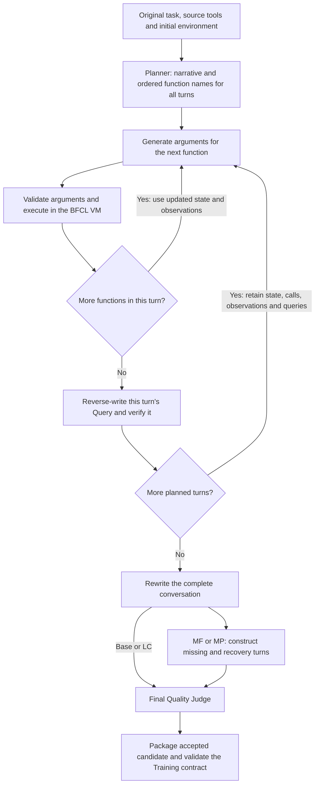

# Second synthesis method: Codex CLI

ToolWeave provides a second data-construction method alongside the original
[Gemma vLLM deployment](../environment/gemma-synthesis/README.md). Python calls
the official `codex exec` CLI using an existing ChatGPT login. The Codex backend
does not call an LLM SDK or an API-key HTTP endpoint. Python executes every tool
call in the real BFCL VM; Codex supplies the structured text for each role.

The two backends share the data-construction framework. This method adds a
task-only Planner, explicit role inputs, durable CLI-response logging and the
current final-query review policy. It is a project implementation, separate
from the provenance of the released Stage 3 checkpoint.

## Construction framework

**Planner plans the whole task → build each turn by generating one function's
arguments and immediately executing it in the VM, then reverse-write that
turn's Query → rewrite the complete conversation → apply MP/MF transformations
→ review the final conversation → package the data.**

中文流程：**Planner 规划整条任务 → 逐轮构建〔逐个生成函数参数并立即在 VM
执行，再反写该轮 Query〕→ 整段润色 → MP／MF 特殊处理 → 最终整段审查 →
打包数据。**



| Role | Receives | Produces |
| --- | --- | --- |
| Planner | Original Queries and reference GT, source tool definitions/restoration events, initial environment preview, category and generation budgets | One prospective task narrative and ordered function names for every planned turn |
| Parameter Generator | Selected function schema, narrative, latest VM state and successful execution history | Arguments for that function |
| BFCL VM | A concrete function call | Actual Observation and pre/post state |
| Query Generator | Current turn's successful calls/results, earlier new Queries and successful calls/results, task narrative | One natural user Query for the current turn |
| Coherence Rewrite | Complete new Queries, calls/results and narrative | Same-count Queries expressing a coherent conversation |
| MF/MP Transformer | Complete executable conversation | One missing turn followed by one recovery/clarification turn |
| Quality Judge | Final Queries/GT, real execution evidence, tool definitions and per-turn visibility | Accept/reject; at most one Query repair and review of the changed text |
| Candidate Builder | Accepted conversation and validation records | Candidate JSON accepted by the schema and frozen Training validator |

The Planner receives neither the old student rollouts nor an extracted topology
JSON. Reference GT describes the source task; new GT is the new, successfully
executed call chain. Each role gets a separate ephemeral CLI request and receives
its context explicitly from Python. Parameter generation and Query generation
alternate by turn; the system does not precompute every argument before executing.

## What changes across the four categories

All four categories first construct a complete executable conversation.
Category rules guide the Planner without changing its output format.

| Category | Final construction |
| --- | --- |
| Base | Keep the complete conversation and its executable GT. |
| Missing Function (MF) | Hide one necessary function's complete initial definition. Keep the affected Query, set its GT to `[]` and remove its execution Observation. Insert the next turn with the restored tool definition and the original calls. Its Query is empty: the Actor receives a tool-update event and a fixed update message. |
| Missing Parameter (MP) | Rewrite the affected Query to omit a necessary value and any uniquely identifying clue; set its GT to `[]` and remove its execution Observation. Insert a clarification Query supplying the value and execute the original calls. |
| Long Context (LC) | Use the same construction steps with VM `long_context=True`. Supported tools produce extended output, from which later turns select relevant information. There is no additional LC transformation. |

MF and MP each add **one** turn: an existing turn becomes the missing turn,
and the inserted next turn performs the original operation. They do not add
two turns. The successful baseline evidence belongs to the recovery turn.

For LC, the flag belongs to the VM session, not an individual function argument.
The Planner has LC guidance but no explicit function-level map of long-output
triggers. A label or a long request alone does not establish LC behavior; the
actual tool history must contain extended output that the task uses.

## Final review

After rewriting and MF/MP conversion, the default policy performs one final
Quality Judge review using the successful synthesis trace. It checks Query-GT
alignment, state consistency, cross-turn coherence, naturalness, and whether
missing and recovery behavior is justified. The Judge sees definitions for
unused visible tools as well, so MF review can consider available alternatives.
MP review uses only the current request and preceding Actor-visible history;
future clarification, hidden state and Planner narrative cannot fill a missing
user choice. An intentional missing turn legitimately has empty GT.

Tool visibility, argument budgets, candidate schema and the Training contract
remain program checks. Final GT replay is disabled by default because replaying
an already successful call chain cannot establish that its rewritten Query is
valid. `replay_final_gt: true` enables the extra replay; `validation_policy:
strict` retains the earlier blocking checks and replay. The default differs
from RODS Appendix G at this point. See the
[exact review policy](../stage1_format_rl/docs/RODS_VALIDATION_POLICY.md).

Per-turn Query verification still runs during construction. “One final review”
does not mean there is only one model check in the entire workflow. If the
final Judge rejects wording that can be repaired, at most one Query refinement
and a second Judge call are allowed. GT-unfixable defects are dropped.

## Published real examples

The [example bundle](../data/codex-synthesis/README.md) contains four genuinely
constructed candidates, one per category, and their actual execution evidence.
The original candidate JSON files are copied byte-for-byte; the combined
training JSONL is exported from their original `sample` objects.

| Source seed | Final turns | GT calls | Original candidate |
| --- | ---: | ---: | --- |
| `multi_turn_base_33` | 4 | 6 | [Base](../data/codex-synthesis/base.json) |
| `multi_turn_miss_func_33` | 5 | 5 | [MF](../data/codex-synthesis/missing_function.json) |
| `multi_turn_miss_param_33` | 5 | 7 | [MP](../data/codex-synthesis/missing_parameter.json) |
| `multi_turn_long_context_33` | 3 | 5 | [LC](../data/codex-synthesis/long_context.json) |

These examples were accepted during the **2026-10-07 strict-policy smoke run**,
before the default review was simplified. They retain their original 12 gate
results, final verifier/Judge decisions, observations and timestamps. They are
not re-labelled as outputs of the latest policy. That run used real Codex
responses, including exact-role/exact-prompt reuse of completed real responses,
and executed fresh BFCL VMs. Synthetic smoke progress values are not measured
RL boundary statistics. These four related examples establish feasibility;
they do not measure a batch success rate or training benefit.

## Code and use

- [Codex CLI transport](../code/AWorld-RL-stage1-worktree/EnvTuning/env_tuning/rods_data_generation_v1/codex_backend.py)
- [Generation pipeline](../code/AWorld-RL-stage1-worktree/EnvTuning/env_tuning/rods_data_generation_v1/pipeline.py)
- [Codex configuration](../stage1_format_rl/configs/rods_data_generation_codex_cli.yaml)
- [Planner contract](../stage1_format_rl/docs/PLANNER_V2_DESIGN.md)
- [Real-seed smoke runner](../stage1_format_rl/scripts/run_codex_category_smoke.py)

The CLI model is inherited from its local configuration when `llm.model` is
empty. Recorded historical candidates have an empty model-override field;
this release does not claim a server-confirmed model ID. The CLI backend checks
for an existing ChatGPT login, removes API-key environment variables from its
child process, and records requests, responses and events locally.

From the repository root, with the project Python dependencies installed:

```bash
export PYTHONPATH="$PWD/code/AWorld-RL-stage1-worktree/EnvTuning${PYTHONPATH:+:$PYTHONPATH}"
python stage1_format_rl/scripts/verify_codex_synthesis_examples.py
```

This checks the four published files, their SHA256 digests, candidate schema,
Training contract, GT/recorded-trace alignment and JSONL export without an LLM
request or VM replay.

To construct new smoke samples, use an installed Codex CLI with an existing
ChatGPT login and the original BFCL training parquet:

```bash
python stage1_format_rl/scripts/run_codex_category_smoke.py \
  --dataset /absolute/path/to/bfcl_train.parquet \
  --output /absolute/path/to/local/codex-smoke \
  --sample-ids multi_turn_base_33 multi_turn_miss_func_33 \
               multi_turn_miss_param_33 multi_turn_long_context_33 \
  --concurrency 1
```

The smoke runner writes candidates and audit records to the selected local
directory. Adding these example files to GitHub does not insert them into an
active Training queue.
