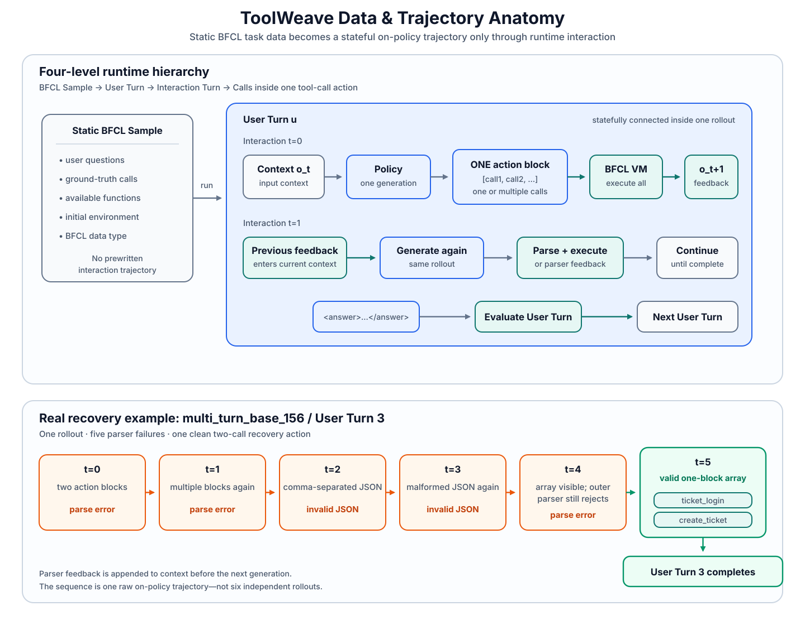

# Data & Trajectory Anatomy

ToolWeave separates a static BFCL task from the on-policy trajectory produced when a model actually attempts that task. This distinction matters: the dataset defines the problem and its executable environment, while interaction turns, observations, parser failures, and corrections emerge only at rollout time.

This page documents data and runtime structure only. It does not define a new local reward, return, normalization rule, or eligibility policy.

[← Back to ToolWeave README](../README.md)

<div align="center">
  
</div>

## 1. Static BFCL Task Data

A BFCL task/sample is a static problem definition. In the audited ToolWeave runtime, its prompt-level context contains:

- a sequence of user questions;
- per-user-turn ground-truth tool-call structures;
- the functions available to the policy;
- the initial environment state/configuration; and
- a BFCL data type.

The public BFCL data is upstream task data, not a collection of ToolWeave-generated demonstrations. A static row does **not** prescribe the assistant/environment exchanges that will occur while a policy solves it. See the upstream [BFCL data documentation](https://github.com/ShishirPatil/gorilla/tree/main/berkeley-function-call-leaderboard/bfcl_eval/data) and [EnvTuning](https://github.com/inclusionAI/AWorld-RL/tree/main/EnvTuning) for the original environment-oriented data layout.

## 2. From a BFCL Sample to an On-Policy Trajectory

At rollout time, the current policy and the BFCL environment create a dynamic trajectory:

```text
static BFCL sample
  -> initialize the task environment
  -> policy generation
  -> parse one complete assistant action
  -> execute parsed calls or evaluate an answer
  -> append environment feedback to context
  -> policy generation again, if the task is still active
  -> complete one stateful multi-turn rollout
```

The resulting trajectory can contain raw assistant actions, parsed calls, observations, parser or execution failures, final answers, actor-token spans, and runtime provenance. Those objects are generated online; they are not pre-authored interaction trajectories stored in the dataset.

For one prompt, ToolWeave samples a group of rollouts. In the audited formal-training artifact, each prompt has `K=16` independently sampled trajectories that share one prompt-group UID but have distinct rollout IDs.

## 3. The Four-Level Interaction Hierarchy

ToolWeave documentation uses the following hierarchy:

```text
BFCL Sample
└── User Turn u
    └── Runtime Interaction j
        └── Calls inside one tool-call action
```

The levels have different meanings:

1. **BFCL Sample** — one stateful task containing multiple connected user turns.
2. **User Turn** — one user request and its corresponding GT call structure `G_u`.
3. **Runtime Interaction** — one policy generation followed by parser/environment handling.
4. **Calls inside one action** — zero, one, or several parsed API calls emitted by that single generation.

The active provenance records `runtime_interaction_index=j` as the zero-based generation index within a BFCL user turn. The backward-compatible field `policy_step_id` is a legacy alias for this runtime index. Both reset when the runtime advances to the next user turn.

The frozen Stage-3 formal algorithm uses every temporally reliable **non-answer runtime interaction** as its local temporal axis:

- a successfully parsed `tool_call` remains one runtime interaction;
- a parser-rejected or otherwise unparsed non-answer generation remains one runtime interaction with no parsed calls;
- a valid final answer/turn closure is excluded from the local sequence and remains global-only; and
- every call inside one valid multi-call action remains inside the same $j$ rather than becoming a separate temporal step.

The historical `tool_attempt_index` field may still appear in serialized provenance for compatibility and diagnostics. It is not used for discount distance, peer grouping, normalization, advantage alignment, or token broadcast. This page maps runtime data to the implemented terminology; the complete reward and advantage equations remain in the main README.

## 4. What Defines a Runtime Interaction?

One runtime interaction begins from the current context and ends after the runtime returns one new observation or advances the BFCL user turn:

```text
current context / observation
        |
        v
policy performs one generation
        |
        v
<think>...</think>
<tool_call>[call1, call2, ...]</tool_call>
        |
        v
parser classifies the complete assistant action
        |
        v
environment executes all parsed calls
        |
        v
one new observation enters the context
        |
        v
next runtime interaction
```

Alternatively, the generation can end with an answer:

```text
<think>...</think>
<answer>...</answer>
        |
        v
environment evaluates the current user turn
        |
        v
next BFCL user turn, or trajectory termination
```

A parser error does not create a new rollout. The error message is returned as environment feedback in the same trajectory, and the policy may generate again for the same `user_turn_id`.

## 5. Multiple Calls in One Tool-Call Action

The executable outer protocol accepts one thinking block and exactly one action block. A tool action has exactly one `<tool_call>` block whose body is valid JSON:

```text
<think>...</think>
<tool_call>
[
  {"name": "call_1", "arguments": {...}},
  {"name": "call_2", "arguments": {...}}
]
</tool_call>
```

The body may be one JSON object or a JSON array. An array represents several executable calls inside **one** runtime interaction. The runtime parses that complete action, executes all parsed calls, and returns one environment-feedback message containing the execution results.

The following is not one valid multi-call interaction:

```text
<tool_call>{"name": "call_1", ...}</tool_call>
<tool_call>{"name": "call_2", ...}</tool_call>
```

Multiple `<tool_call>` blocks are protocol-invalid. A response is also rejected when it has missing or duplicate `<think>` pairs, both tool and answer blocks, text outside the required blocks, or invalid JSON inside the selected tool block.

## 6. Ground Truth Does Not Fix Interaction Segmentation

For user turn `u`, BFCL ground truth `G_u` defines the expected tool-call structure used to evaluate that turn. It does **not** dictate how the policy must distribute those calls across runtime interactions.

The audited sample `multi_turn_base_156` makes the distinction concrete.

### User Turn 0: two GT calls across two interactions

The static GT contains:

```text
get_flight_cost(...)
book_flight(...)
```

The observed rollout segments them as:

```text
Interaction 0: get_flight_cost(...) -> cost observation
Interaction 1: book_flight(...)     -> booking observation
Interaction 2: answer               -> user-turn evaluation
```

Two GT calls therefore do not imply one two-call policy action.

### User Turn 3: two GT calls inside one valid action

The static GT contains:

```text
ticket_login(username=<USERNAME>, password=<PASSWORD>)
create_ticket(...)
```

After several protocol failures, the final parsed action for this user turn is:

```text
ONE interaction turn
└── ONE <tool_call> block
    └── JSON array
        ├── ticket_login
        └── create_ticket
```

Here the two GT calls are ultimately represented by two parsed calls inside one interaction. These two examples show why GT call count and interaction-turn count must not be conflated.

## 7. Real Parser-Recovery Trajectory

### Case Study: Recovering from Tool-Call Format Errors

The audited record is JSONL line 10 of the Stage 3 formal-training rollout artifact:

| Identity field | Audited value |
|---|---|
| Original BFCL sample | `multi_turn_base_156` |
| JSONL line / `trajectory_index` | `10` / `9` |
| Prompt-group UID (`non_tensor.uid`) | `1b94ddc9-3612-48c4-acf2-7b755d72330f` |
| Independent rollout ID | `8516d0df-e6fb-4a67-969d-637bfd967e77` |
| `rollout_offset` within the `K=16` group | `9` |
| User turn | `3` |

The prompt-group UID is shared by all 16 rollouts sampled for this prompt. It is **not** the unique rollout identity. All 512 audited records have distinct `matchtir_provenance.rollout_id` values; the value above identifies this particular trajectory.

The runtime-recorded sequence for User Turn 3 is:

| Runtime interaction | Recorded action shape | Parser result |
|---:|---|---|
| `j=0` | Two separate `<tool_call>` blocks | `parse_error`: multiple tool-call pairs |
| `j=1` | Again emits two action blocks | `parse_error`: multiple tool-call pairs |
| `j=2` | One visible action block with comma-separated JSON objects but no array | `parse_error`: invalid JSON |
| `j=3` | Repeats the malformed comma-separated form | `parse_error`: invalid JSON |
| `j=4` | The visible action block contains a valid two-object JSON array, but the reasoning text itself includes a literal `<tool_call>` opener | `parse_error`: the outer parser extracts contaminated content and rejects it as invalid JSON |
| `j=5` | One clean action block containing one valid JSON array | `tool_call`: parses `ticket_login` and `create_ticket` |

The `j=4` diagnosis follows the actual parser order: its tag regular expression scans the complete response, including reasoning text, before JSON decoding. The literal opener inside `<think>` is therefore visible to the outer grammar.

These are **not six new rollouts**. They are six non-answer runtime interactions inside:

```text
ONE rollout trajectory
└── ONE BFCL user turn
    └── MULTIPLE policy generations with parser feedback in context
```

This is a valid raw on-policy trajectory containing both protocol failures and self-correction. User Turn 3 eventually reaches a valid action and passes its turn-level check. A later user turn predicts an incorrect ticket identity and ends with an unsuccessful environment outcome, so this record is not a clean demonstration trajectory and should not be described as fully successful.

## 8. Raw Rollout Artifact Statistics

The following values were recomputed by parsing all 512 JSONL records and replaying every raw policy response through the audited runtime parser.

### Batch composition

| Measure | Value |
|---|---:|
| Raw trajectories | 512 |
| Unique BFCL samples | 32 |
| Unique prompt-group UIDs | 32 |
| Unique rollout IDs | 512 |
| Rollouts per sample / group | 16 |
| `global_step` | 2 |
| `epoch` | 0 |
| `batch_index` | 1 |
| Total BFCL user turns | 2,320 |
| User turns per trajectory | 2–8 |
| Mean user turns per trajectory | 4.53125 |
| Total recorded interaction turns | 5,173 |

`global_step=2` labels the second training-step update bundle in this formal-training run. It is training metadata, not a user-turn, interaction-turn, or rollout identifier.

### Four-type balance

| BFCL data type | Unique samples | Trajectories |
|---|---:|---:|
| `multi_turn_base` | 8 | 128 |
| `multi_turn_miss_func` | 8 | 128 |
| `multi_turn_miss_param` | 8 | 128 |
| `multi_turn_long_context` | 8 | 128 |

Each type therefore contributes `8 prompts x 16 rollouts = 128 trajectories`.

### Runtime actions and calls

| Recorded quantity | Count |
|---|---:|
| `response_type=tool_call` | 2,827 |
| `response_type=answer` | 1,878 |
| `response_type=parse_error` | 468 |
| Successfully structured individual calls | 2,828 |
| Trajectories containing at least one parse error | 98 |
| Parser-error user turns | 161 |

Among the 2,827 parsed tool-call interactions:

- 2,826 contain exactly one parsed call;
- exactly one contains two parsed calls; and
- that unique two-call interaction is `multi_turn_base_156`, rollout ID `8516d0df-e6fb-4a67-969d-637bfd967e77`, User Turn 3, runtime interaction `j=5`.

For an observed recovery statistic, define a parser-error user turn as **same-turn recovered** when any later interaction with the same `user_turn_id` has `response_type` in `{tool_call, answer}`. Under that exact definition, 105 of 161 turns recover (`65.22%`). A stricter terminal criterion—requiring a parsed action after the **final** parser error—gives 102 of 161 (`63.35%`). These are descriptive measurements of this formal-training artifact, not BFCL benchmark metrics.

Parser replay produced zero response-type mismatches, structured-call replay produced zero call-list mismatches, all prompt groups contained offsets `0..15`, and all per-user-turn `policy_step_id` sequences were contiguous from zero.

## 9. BFCL Data Types

The four audited types share the same static-task/on-policy-rollout distinction but stress different environment conditions.

| Type | Static task characteristic | Empty-GT behavior in this artifact |
|---|---|---|
| Base | Complete information needed for the intended function path is available through the request, prior results, or initial state. | No empty-GT user turns. |
| Missing Function | A required function is withheld for an affected request; the policy should recognize that the action is unavailable before a later recovery turn supplies the held-out capability. | Exactly one `G_u=[]` turn per trajectory: 128 total. |
| Missing Parameter | Required information is absent and cannot be recovered from the current state; the affected turn calls for clarification rather than an executable tool action. | Exactly one `G_u=[]` turn per trajectory: 128 total. |
| Long Context | The task includes large, distracting environment state or results while retaining the multi-turn tool-use objective. | No empty-GT user turns. |

Consequently, it is incorrect to say that every BFCL user turn always has non-empty GT tool calls. A normal non-empty-GT turn provides a tool-call comparison scope. An empty-GT Missing Function or Missing Parameter turn has different data semantics and must be represented as such. This structural distinction does not itself define any new local-credit rule.

## 10. Relation to MatchTIR

ToolWeave uses the following structural analogy when discussing interaction-local information:

| MatchTIR structure | ToolWeave/BFCL structure |
|---|---|
| MatchTIR query | BFCL user turn |
| MatchTIR interaction turn | ToolWeave non-answer runtime interaction (`runtime_interaction_index`) |
| Predicted calls in one interaction | Parsed calls inside one ToolWeave tool-call action |

The analogy is not dataset identity. A BFCL sample contains multiple statefully connected user turns, whereas a MatchTIR task uses a single-query trajectory. ToolWeave's implemented local method operates on the non-answer runtime sequence described above; this data document intentionally leaves its mathematical definition in the main README rather than duplicating it here.

## 11. Field Reference

| Field | Scope and meaning |
|---|---|
| `trajectory_index` | Zero-based record position in the dumped rollout batch; JSONL line number is `trajectory_index + 1` in this artifact. |
| `global_step` | Trainer-global update-step label attached to the rollout batch. It is not an interaction index. |
| `batch_index` | Zero-based batch/update index within the recorded epoch. |
| `epoch` | Training epoch index associated with the rollout. |
| `non_tensor.index` | Original BFCL sample identifier, such as `multi_turn_base_156`. |
| `non_tensor.uid` | Prompt-group UID shared by the `K` rollouts generated from one prompt; used for rollout-group operations. |
| `matchtir_provenance.rollout_id` | Independent identity of one sampled rollout trajectory. |
| `matchtir_provenance.rollout_offset` | Zero-based rollout position inside the prompt’s `K`-sample group. |
| `user_turn_id` | Zero-based BFCL user-turn index inside one stateful sample. |
| `policy_step_id` | Backward-compatible legacy name for the zero-based runtime-generation index inside one user turn. |
| `runtime_interaction_index` | Explicit zero-based index $j$ for every assistant generation inside one user turn. |
| `tool_attempt_index` | Backward-compatible diagnostic index for classified tool attempts; not the formal local temporal or normalization axis. |
| `response_type` | Runtime parser classification: `tool_call`, `answer`, or `parse_error`. |
| `attempted_action_type` | Parser-grounded attempted action: `tool_call`, `answer`, or `unknown`. |
| `temporal_provenance_reliable` | Whether rollout ownership, user-turn ownership, runtime ordering, and attempted-action timing are trustworthy. |
| `actor_span_reliable` | Whether the assistant action's actor-token interval can safely receive a local residual. |
| `call_parse_reliable` | Whether the action produced successfully parsed structured calls; false for parser-rejected tool attempts. |
| `calls` | Structured individual calls parsed from one valid tool-call action; grouping inside the interaction is preserved. |
| `actor_span` | Response-relative half-open token interval `[start, end)` for the policy-generated assistant action. Environment tokens are outside this actor span. |
| `ground_truth` | Static BFCL per-user-turn expected call structure copied into rollout provenance. It does not prescribe interaction segmentation. |
