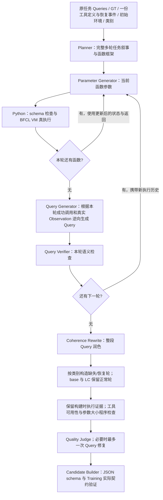

# ToolWeave Planner v2：实际实现与输入输出契约

本方案已经接入 Generator 主流程。Planner 为一条 seed 一次规划一条新任务的完整多轮框架；后续代理逐个生成参数，在 BFCL VM 中执行，再逐轮生成 Query。四类任务共享输入和输出格式，但每次只加载当前类别的规则。

项目通过 Python 子进程调用官方 `codex exec`，使用已有 ChatGPT 登录。不在这个后端中调用 LLM API 或 SDK。CLI 自身会与服务通信，不能把它理解成离线模型。新提示词和类别阈值属于项目设计，源码标注 `PROJECT_SUBSTITUTION`，不声称是论文原版提示词。

## 1. Planner 的输入

输入契约为 `toolweave.planner_input.v2`，由 `planner_contract.build_planner_input()` 按字段白名单构建，并由 `planner_input_v2.schema.json` 校验。不会把整个 seed 或任意 `generation_metadata` 直接序列化给模型。

| 字段 | 实际内容与来源 | 用途 |
| --- | --- | --- |
| `schema_version` | 固定为 `toolweave.planner_input.v2` | 校验版本 |
| `sample_id` | 原任务 ID | 请求与审计关联 |
| `data_type` | 四类之一 | 选择对应的类别规则 |
| `involved_classes` | 从该 seed 与函数目录推导的工具类 | 约束规划的工具范围 |
| `original_task.user_queries` | 原始 `Q_old`，保留轮次和消息结构 | 理解原用户目标与交互方式 |
| `original_task.reference_ground_truth` | 原始 `GT_old`，保留调用字符串、参数和空 GT 轮 | 理解预期操作；它不是执行成功的证据 |
| `original_task.initial_tool_definitions` | 从原始系统提示提取的原工具 schema，只提供一份 | 复用已有函数说明，不另附全局 128 工具列表 |
| `original_task.tool_updates` | 原任务恢复轮的 `{turn_id, tools}` | 补齐初始工具列表中被有意隐藏的工具 |
| `initial_environment.config` | 本次生成实际使用的完整初始配置；首次为原配置，重试可包含补丁 | 提供沙盒起点 |
| `initial_environment.runtime_snapshot_view` | 用该配置创建真实初始 VM 后取得的快照视图；独立调用构建器时可为 null | 反映 VM 初始化后的真实对象，而非猜测 |
| `initial_environment.long_context` | 仅 long_context 类为 true | 与 VM 模式一致 |
| `generation_contract` | 轮数、函数数、工具类、恢复轮和递归参数限制 | 模型与解析器遵守同一个预算 |
| `retry_feedback` | 仅重试时提供：本次生成失败、禁用函数、指导和累计配置变更 | 重新规划新的生成尝试 |

工具定义不再随原始 Actor 系统提示整段重复粘贴。这里保留的是从该提示中读取的同一份函数 schema；Actor 的 `<think>/<tool_call>` 输出协议不属于 Planner 的输出协议。

`tool_updates` 是原始数据的工具恢复信息，不是学生 rollout。Training 从原 `processed_question` 中的工具更新消息确定性提取它，放入 `generation_metadata.planner_source.tool_updates`。旧 seed 没有该字段时，可以从当前训练 parquet 按原 ID 恢复相同事件。工具 schema 必须与活动函数目录完全一致，重复或畸形定义会被拒绝；不能从共享字符串或模型执行轨迹猜测恢复事件。

初始运行时快照的视图会明确标记截断：长字符串超过 1000 字符时保留前缀、原长度及 SHA256；字典最多展示 40 项，列表最多展示 20 项。完整 `config` 仍保留。截断视图不能被当成完整文件内容。生成器可见的内部配置也不能被自动当成最终 Actor 已知的信息，尤其是 missing_parameter 类。

输入中没有原学生的 16 条 rollout，没有旧实际调用、Observation 或回答，也没有提取出的拓扑 JSON。旧 rollout 仍可在 Training 侧用于边界选择和进度计算；新的执行历史只在后续生成阶段产生。源码保留的 AST 结构统计用于生成后的诊断，不输入 Planner。

### 真实例子：`multi_turn_base_33`

这条原任务包含 5 轮 Query、5 轮参考 GT、28 个初始工具 schema，工具类为 `GorillaFileSystem` 和 `MessageAPI`，没有恢复工具事件。参考 GT 原文如下：

```json
[
  ["ls()"],
  ["grep(file_name='deploy.py', pattern='def')"],
  ["grep(file_name='deploy.py', pattern='update')"],
  ["send_message(receiver_id='USR003', message='update the system')"],
  ["view_messages_sent()"]
]
```

原初始配置的文件系统根顺序为 `project`、`backup_scripts`。BFCL 加载第一个根，所以不能排序后再保存配置。现在队列、检查点和 Training 样本序列化保留这个顺序，完整输入无需再改成旧实测中的 project-only 配置。`deploy.py` 的真实内容只有一个物理行：

```text
def deploy():    # update the system    pass# update the database# update the server# final checks
```

四条 ID 为 33 的完整实际输入和渲染后的提示词已经导出到本次工作区：

| 原数据类别 | 完整输入 | 完整提示词 |
| --- | --- | --- |
| base | `/mnt/data/toolweave_planner_v2_audit/current_inputs/multi_turn_base_33/input.json` | 同目录 `prompt.txt` |
| miss_func | `/mnt/data/toolweave_planner_v2_audit/current_inputs/multi_turn_miss_func_33/input.json` | 同目录 `prompt.txt` |
| miss_param | `/mnt/data/toolweave_planner_v2_audit/current_inputs/multi_turn_miss_param_33/input.json` | 同目录 `prompt.txt` |
| long_context | `/mnt/data/toolweave_planner_v2_audit/current_inputs/multi_turn_long_context_33/input.json` | 同目录 `prompt.txt` |

例如 `multi_turn_miss_func_33` 初始只有 27 个 schema，另有原恢复事件 `{turn_id: 4, tools: [message_login 的完整 schema]}`。这正是不能只读取最初系统工具列表的原因。这里的 `turn_id` 从 0 开始。

## 2. 四类规则怎样进入 prompt

默认 `validation_policy: rods` 的实际组合为：`project/planner_common_rods.txt` + 当前类别的一个规则文件 + 上述输入 JSON。LC 使用 `planner_categories/long_context_rods.txt`。可选 `strict` 模式沿用 `project/planner_common.txt` 和原 LC 规则；其他三个类别的规则不会混入本次请求。

| 类别 | Planner 输出的框架 | 后续处理 | 本类验收重点 |
| --- | --- | --- | --- |
| `multi_turn_base` | 2–5 个正常可执行轮 | 执行、逐轮 Query、整段润色 | 用户目标与操作一致、必要前后关系合理 |
| `multi_turn_miss_func` | 2–4 个完整可执行轮，预留 1 个恢复轮 | 选择必要工具的首次使用轮；从初始可见工具中隐藏它；受影响轮 `GT=[]`；紧接着恢复 schema 并执行原 GT | 缺少的工具是否真的必要，其他可用工具是否能等价完成 |
| `multi_turn_miss_param` | 2–4 个完整可执行轮，预留 1 个澄清轮 | 选择真正未知的必要值；受影响 Query 不给该值且 `GT=[]`；紧接着由用户澄清并执行原 GT | 该值不能已经由 Actor 的先前请求、调用或 Observation 给出 |
| `multi_turn_long_context` | 2–5 个轮；先暴露长 Observation，再在后轮使用其中信息 | 使用 BFCL `long_context=True` 模式执行 | 长输出实际出现，并且后轮确实需要从中定位或使用信息 |

MF/MP 的 Planner 输出是完整可执行的基础框架，最终缺失轮由 transformer 构造。新任务的缺失位置不必复刻原任务的恢复位置。当前生成路径中这两类最终有 3–5 轮；全部类别最终不得超过 5 轮。

MP 基础叙事要先确定将来用户会选的具体值，并说明只在受影响请求中披露。这样 Parameter Generator 才能生成完整基础调用；Transformer 后续删除该选择及同义的唯一定位线索，并由澄清轮恢复。叙事中的未来选择不能被当作先前 Actor 已知的信息，也不能写进早先 Query。

默认模式要求 LC 后轮实际使用早先的长历史，由模型核对信息关系和任务意义。此前 2048 字符暴露门槛、同一大型标量中的两处取值、50% 跨度与末尾 20% 位置均保留为诊断，在 `strict` 模式才作为拒绝条件；这些项目阈值并非 BFCL 官方定义。

LC 的 Planner 还要求后续选择/组合实际使用早先的大 Observation，避免再次读取同一内容或在 Query 中粘贴完整答案来绕过历史。现在四类的 Query Generator 和逐轮 verifier 都接收本次新任务的实际 prior call/result，其中历史字段仅包含 Actor 可见轨迹，不含原学生 rollout 或内部 pre/post 快照。接收者等用户偏好仍要足够明确。逐轮 verifier 的独立审计字段可含本轮 pre/post，不能把它当成 Actor 的知识。

## 3. Planner 的输出

语义输出严格按以下顺序排列：一个非空 `<reason>`、一个非空 `<narrative>`、若干 `<turn>`。标签之外不能出现说明、Markdown 围栏或 JSON 计划。

```xml
<reason>简短的规划依据与必要的不确定性。</reason>
<narrative>新用户希望完成的目标，各轮之间的联系，以及对象、数量和约束。</narrative>
<turn>ClassName: function1, function2</turn>
<turn>ClassName: function3</turn>
```

`reason` 放规划机制；`narrative` 只描述将来的用户目标与约束，不把“之后 transformer 会隐藏工具”等生成器机制写成用户目标。每个轮只指定一个工具类及该类 1–3 个函数名称，按调用顺序排列。相同函数可以使用不同参数多次调用，但执行阶段会拒绝同轮完全相同的重复调用。

Parser 检查标签顺序、非空字段、类别轮数预算、工具范围、禁用函数以及工具类对应关系。允许函数来自原初始 schema 与原恢复 schema 的并集，而非该工具类的全部全局函数。高阶函数如有确定性分解，后续实际调用的是分解后的 VM 原语；规划层的函数数量限制不是原语调用数限制。

实际解析结果为 Python `PlannerResult(reason, narrative, turns)`；每个 `PlanTurn` 有 `turn_id`、`class_name`、`function_names`。JSON 展示是这个解析结果的序列化，不是模型需要再输出一份 JSON。

Planner 不输出具体调用参数、最终用户 Query、Observation、最终 GT 或执行成功判定。叙事可以给出用户的数量和偏好，机器可执行的参数对象由下一角色生成。

叙事要说明任务目标、约束和需要从真实执行历史取出的信息，不能提前把尚未获得的文件事实填好。确有精确格式要求时，可以使用 `File: {filename}; Lines: {lines}` 这样的模板；Parameter Generator 根据执行历史实例化，Query Generator 表达对应的用户要求。默认 rods 模式不为所有文本任务强制固定模板或精确引用语法，但 Query 仍必须足以支持实际参数与 GT。strict 保留此前更严格的格式和搜索文本约束。格式要求不能替代自然、必要的任务目标。

`generation_contract.argument_limits` 固定为 `{max_string_characters: 200, max_collection_items: 5}`，与项目现有的递归参数复杂度 gate 共用常量。Planner 据此设计能放进参数的消息和选择集合；Parameter Generator 也接收相同预算，并在调用 VM 前拒绝超限参数。不能通过截断用户要求原样保留的内容来满足预算，也不限制 Observation 必须少于 200 字符。

通过 `codex exec` 传输时，最外层文件格式为 `{"text": "上述 XML 文本"}`。CLI 的 JSON schema 约束这个传输包装，项目 Parser 约束内部 Planner 语义格式，两者各有用途。

## 4. 角色怎样合作



| 角色/组件 | 收到什么 | 输出什么 | 初次正常生成的频率 |
| --- | --- | --- | --- |
| Planner | 本文输入契约 | 叙事与全部轮的函数名称 | 每条 seed 一次 |
| Parameter Generator | 当前函数 schema、当前真实状态、已执行的新调用和返回、叙事 | 参数对象 | 每个实际执行函数一次 |
| BFCL VM | 已校验函数名与参数 | 真实返回、成功状态、调用前后状态 | 每个实际执行函数一次 |
| Query Generator | 当前轮成功调用和返回、此前新轮的历史、叙事 | 当前轮自然语言 Query | 每个可执行基础轮一次 |
| Query Verifier | 当前 Query、该轮工具定义、真实调用/返回与调用前后状态证据 | accept/reject | 每个基础轮一次 |
| Coherence Rewrite | 全部新 Query、GT、Observation 与叙事 | 数量相同的整段 Query | 完整基础对话一次 |
| MF/MP Transformer | 完整基础对话与类别要求 | 受影响轮及恢复/澄清轮 | 仅对应类别一次 |
| Final Query Verifier（仅 strict） | 润色和类别转换后的最终对话与执行证据 | 最终语义 accept/reject | strict 模式最终对话一次，修复后需重查；默认模式由 Judge 审查最终对话 |
| Quality Judge / Refine | 最终对话、可见工具定义及逐轮可用性、构建时真实调用前后状态与返回 | 接受、拒绝；可修复时改 Query | Judge 正常一次，最多一次修复周期 |

每个逻辑角色都通过同一个可配置后端调用，但每次 `codex exec --ephemeral` 是独立会话，角色之间只通过 Python 传递的明确字段共享信息。这些角色不是同时保持记忆的聊天线程，也不是彼此独立的真值来源。

Query 是按照新任务的轮次逐轮生成的。每轮先完成本轮实际调用与执行，再逆向生成本轮 Query；无需等整条链全部成功后才生成所有 Query。整个基础对话成功构造后，再统一润色并做类别转换。

缺失轮在最终样本中没有真实调用，`GT=[]`，执行记录也为空；基础合成时的成功记录归到紧接着的恢复轮。记录保留原调用和前后状态，并用 `synthesis_turn_id` 保留合成轮来源。默认最终审查复用这些真实证据，不再次执行 GT。`replay_final_gt: true` 或 strict 模式可启用独立新 VM 重放；重放检查调用可执行性，不能证明最终 Query 的语义成立。

最终 verifier 与 Judge 接收由这些记录确定性构建的 `planner_scaffold_alignment`。Planner 叙事若按轮号描述步骤，该编号对应插入缺失/澄清轮之前的可执行框架。验收按映射后的最终执行轮核对效果和顺序；合法的插入不应仅因轮号顺延被判为叙事矛盾。映射不替代动作执行或 Actor 可见信息检查。

Planner 初始快照和基础合成使用不同 VM 实例。没有失败重试的默认路径通常创建 2 个实例；Planner 快照实例只读取状态，立即关闭，不会执行任务调用。显式开启最终 GT 重放或使用 strict 时，通常创建 3 个实例。

## 5. 验收和重试边界

当前默认模式将整段润色和 MF/MP 变换后的语义验收交给一次 Quality Judge，使用构建时保存的真实执行证据；只有 Query 被修复后才再次审查。工具可用性、参数大小、候选 schema 和 Training 契约保留为程序检查。逐轮 Query Verifier 保留。八项项目规则在深拷贝上计算诊断，不改变实际样本，也不阻止它进入 Judge；完整真假结果另存 `generation_metadata.project_diagnostics`。默认 `replay_final_gt: false` 是项目选择，与 RODS 附录 G 的额外新 VM 重放不同；设为 true 可以保留该重放。配置、证据与限制见 [RODS_VALIDATION_POLICY.md](RODS_VALIDATION_POLICY.md)。

### strict 可选模式的额外规则

以下严格规则仅在 `validation_policy: strict` 阻止准入。该模式保留此前 12 项 gate，包括独立的 Final Query Verifier，以及类别协议、单位语义、参数来源、缺失参数有效性、Observation 支持、关系定位、精确文本、动作必要性和三项基础检查。

新 `query_contract_gate` 在最终语义检查前运行，Query Refine 后也重新运行。目前确定性精确文本检查覆盖 `send_message.message` 和 `echo.content`，不是全部 128 个工具的字符串参数。它校验未填值模板、真实成功返回中的值、数组长度、已支持的函数声明选择和末尾定长词摘录；不使用隐藏状态作为取值证据。一般字段的语义选择、替代工具轨迹和自然语言是否足够明确仍由模型 verifier/Judge 检查。固定模板的反例与适用范围见 [QUERY_CONTRACT_HARDENING.md](QUERY_CONTRACT_HARDENING.md)。

计数槽还限定返回路径与单位：字符、行、词分别来自对应 `wc` 模式的 count，匹配行数来自 `grep` 的 matching_lines 长度。不同单位或无关数组中出现相同数字不能替代指定来源。此映射适用于已支持的槽名，其他字段仍有上述语义验证的限制。

参数依据检查与精确文本 gate 共用 `bind_exact_text`，使合法的数组长度等计算值有审计依据，无须把计算结果预先贴进用户请求。这个绑定函数只证明取值来源；历史答案泄漏、LC 信息分布和全局语义仍分别检查。

逐轮、最终 verifier 与 Judge 共享答案整理规则：GT 表示工具调用，助手可以根据真实可见结果计数、排序或展示选项，不要求增加无必要的工具调用。发送、写入、删除等实际操作仍必须出现在 GT 中，缺失用户选择也不能由答案整理补给。模型负责检查整理规则是否明确、是否有全部依据；该协议本身不保证未来 Actor 的答案正确。

Final Query Verifier 明确收到 `data_type`、完整初始工具定义和各轮恢复的工具定义，能够按实际工具可见性检查替代方案。其输入明确区分 Actor 可见的请求/调用/返回与内部审计证据；Planner 叙事和隐藏状态不能补给缺失参数。

当前模式的必需检查失败会丢弃候选，不能被 Quality Judge 的接受覆盖；默认模式的项目诊断失败不执行这一规则。必需检查与 Judge 通过后，Candidate Builder 仍要通过候选 JSON schema 和 Training 实际读取契约。模型 verifier 和 Judge 仍可能误判。

Judge/Refine 的审查输入包含全部 Actor 可见工具的 schema（按已使用与未使用分组）、逐轮工具可见性及每次执行的 pre/result/post。少量 BFCL 返回文案与真实效果有歧义，不能只凭文案判定调用含义。例如 `delete_message` 实际倒序删除最新匹配消息，却返回 “first message” 文案；真实状态能证明哪条消息被删除、哪些旧消息保留。此处快照供 verifier 审计，不增加 Actor 的可见历史，也不能补给 missing_parameter 轮缺失的用户信息。

逐轮 Query Verifier 也收到该轮的工具定义与 pre/result/post，并按同样的可见性约束核对效果。Python 文件的函数声明搜索允许从明确的声明请求推导 `def`/`def ` 关键字；带具体函数名的模式必须在同一文件的先前成功 Observation 中发现相应声明。新的精确搜索检查进一步要求本轮 Query 引用实际搜索字符串。此处约束新任务，并未对 MatchTIR 实施等价模式归一化，也未证明所有合法调用序列唯一。

Judge/Refine 使用项目补充解释 `project/quality_review_contract.txt`：接口泄露指工具 API/参数接口，不把用户源文件中的业务函数名或普通词汇误判为接口泄露。`response_contract_diagnostics` 记录真实 VM 返回与源返回类型的差异，不改写返回或工具定义。仅当任务实际效果正确、没有依赖错误的声明类型时，这类源差异不单独否决候选；参数类型、真实依赖、执行失败和不受支持的 Query 仍按原 gate 拒绝。Refine Rewrite 也接收整段验证上下文，不能通过删掉消息正文制造“复制未提供文本”的请求。

完整构造失败最多尝试 3 次；每次 Planner 解析最多 3 次模型请求。因此最坏情形可以有 9 次 Planner 调用。新尝试接收本次生成失败、禁用函数和当前配置，原学生轨迹仍不输入。当前实现的最终 gate 拒绝会直接丢弃，不会再开启新一轮完整构造；Judge 仅有一次 Query 修复机会。

构造阶段的模型 `BackendError` 记录为后端故障，不把计划中的函数加入黑名单，也不做环境补丁；仍占一次有上限的构造尝试。CLI 额度耗尽有单独的延期协议，见下一节。真实 VM 故障仍按原函数证据与配置修复流程处理。

`parameter_dependency_status=NOT_RECOVERABLE` 等原诊断字段不因使用 Codex 自动变成已证明的因果图。这次修改不声称恢复所有跨轮因果关系；它通过真实执行、可见信息检查和最终验收控制候选有效性。

## 6. CLI 后端和配置入口

后端选择 `llm.backend: codex_cli`，配置入口为 `stage1_format_rl/configs/rods_data_generation_codex_cli.yaml`。`model: ""` 继承已安装 CLI 的模型配置；设置非空值时传给 `--model`。本次方案不会读取旧 Gemma 配置来调用模型。

Python 使用 `asyncio.create_subprocess_exec()` 启动 CLI，无 shell 拼接；子进程环境移除 `OPENAI_API_KEY`、`CODEX_API_KEY`，启动前要求 `codex login status` 显示 ChatGPT 登录。请求使用只读沙盒、独立审计目录、`--ephemeral`、`--json`、`--output-schema` 和标准输入。

超时或取消会终止并回收进程组。返回必须有 `turn.completed` 事件以及单个非空 `text` 字段；发现命令、MCP、网页搜索或文件修改事件时拒绝返回。角色被要求只处理内联输入；真实 VM 执行始终由 Python 完成。

每个完成的请求留存 `request.json`、`prompt.stdin.txt`、`response.schema.json`、`response.json`、`events.jsonl` 和 `stderr.log`。事件和 stderr 实时写入文件，超时有独立错误记录，未完成的请求保留部分日志而没有有效 response。这使各逻辑角色的实际输入和输出可逐项审查。

CLI 后端没有把旧配置中的 temperature、top_p、max_tokens 转换成 CLI 解码控制，不声称复现 Gemma 的采样设置。吞吐、费用、成功率和训练收益需要另做测量。

官方 CLI 若通过错误事件报告 usage limit，后端抛出 `BackendQuotaExceeded` 并停止排队请求继续启动子进程。Pipeline 保留已有有效失败的 checkpoint，但不把额度耗尽记成新的构造失败。Daemon 将自己的 claim 释放为 `PENDING`，记录 `DEFERRED_BACKEND_QUOTA`，不写 terminal drop 或候选，并结束本次运行；额度恢复后重新启动。并发 worker 会先释放各自的 claim。它不会自动购买额度或改用 API。

默认配置为 `dry_run: true`，只读取和验证 seed，不启动生成。队列与审计目录使用独立的 `stage3_generator_codex` 子目录。实际生成需要在本机配置中设置 `dry_run: false`、正确数据与队列路径，并满足现有 launcher 的 `RODS_ALLOW_DATA_GENERATION=1` 和 `--allow-generation` 启动条件。

在仓库根目录、安装项目 Python 依赖后，可运行：

```bash
export PYTHONPATH="$PWD/code/AWorld-RL-stage1-worktree/EnvTuning${PYTHONPATH:+:$PYTHONPATH}"
python -m env_tuning.rods_data_generation_v1.launcher \
  --config stage1_format_rl/configs/rods_data_generation_codex_cli.yaml --once
```

导出具体 Planner 输入不调用模型，也不写 Training 队列：

```bash
python stage1_format_rl/scripts/export_planner_inputs.py \
  --dataset /path/to/bfcl_stage3_train_all_400_shuffled_seed42.parquet \
  --output /path/to/planner_inputs \
  --sample-ids multi_turn_base_33 multi_turn_miss_func_33 \
               multi_turn_miss_param_33 multi_turn_long_context_33
```

省略 `--sample-ids` 导出整个数据集。导出工具的 seed 进度值是明确标注的占位字段，不表示执行了边界选择或测量了模型能力。这些进度字段没有进入 Planner 输入。

四类完整真实模型 smoke 使用 `stage1_format_rl/scripts/run_codex_category_smoke.py`，直接读取源 parquet、调用 Generator 主流程并保存每个角色和真实 VM 的审计文件。复跑方式、最终四例结果及限制见 [FOUR_CATEGORY_SMOKE_20261007.md](FOUR_CATEGORY_SMOKE_20261007.md)。

## 7. 本次证据与限制

完整实际输入和提示词已从 400 条训练任务导出，逐条通过输入契约并读取真实初始 VM 快照，模型调用数为 0。数据源为本次工作区 `bfcl_train.parquet`，SHA256 为 `f6c9311b3b7977b307fcb8d175603e828dbca0542bb3abca4f4bdf922bc8f293`。

四类 `multi_turn_*_66` 均已经通过集成 Codex CLI 的真实 Planner 请求、严格解析与源工具范围校验。真实结果及完整请求位于 `/mnt/data/toolweave_planner_v2_audit/real_planner_results.json` 和 `real_planner_examples/`。这四次测试只检验 Planner，不是四类完整新样本的端到端验收；当时尚未加入“生成器机制仅放 reason”和最后的参数预算，保存文件反映当时的实际输入。

2026-10-07 的较早版本完成四类各一个 `_33` 源任务的端到端验收，最终轮数/调用数分别为 base 4/7、miss_func 5/9、miss_param 5/7、long_context 3/6，当时通过 11 项 gate，回归为 216 passed、1 deselected。严格复审随后发现自由摘要的固定 GT、后轮粘贴历史答案和 LC 只用长文本开头的问题。新的精确文本策略重新检查时，四条旧候选全部拒绝；原记录保留，但不作为新版策略通过的证据。新版实测状态与范围在 [QUERY_CONTRACT_HARDENING.md](QUERY_CONTRACT_HARDENING.md) 单独更新，完整历史见 [PLANNER_V2_VALIDATION.md](PLANNER_V2_VALIDATION.md)。这些相关实例不能证明批量成功率、系统完美、Codex 优于 Gemma或训练效果已提高。

最终新版的四条 `_33` 候选全部通过 12 项 gate、独立 VM、最终 verifier/Judge、Candidate 与 Training 验证。轮数/调用数为 base 4/6、MF 5/5、MP 5/7、LC 3/5；Base 用一次受限 Query Refine，其余没有修复。回归为 248 passed、1 deselected，17 个复审负例均拒绝。完整最终数据与证据见 [公开四类数据与原始验收](../../data/codex-synthesis/README.md)。

## 8. 代码索引

实现根目录：`code/AWorld-RL-stage1-worktree/EnvTuning/env_tuning/rods_data_generation_v1/`。

| 文件 | 负责什么 |
| --- | --- |
| `planner_contract.py` | 输入白名单、原恢复工具、类别预算、快照视图 |
| `planner.py` | 初始 VM 预览、prompt 组合、模型请求与重试 |
| `prompts/project/planner_common.txt` | 共同规则与输出契约 |
| `prompts/project/planner_categories/*.txt` | 四类分别的规划要求 |
| `parsing.py` | Planner 严格解析与工具范围校验 |
| `codex_backend.py` | ChatGPT 登录的 CLI 子进程传输与审计 |
| `validation/category_validity.py` | 最终类别协议与 LC 暴露测量 |
| `validation/query_contract.py` / `prompts/project/query_contract.txt` | 精确文本格式、真实历史取值、明确搜索文本与 LC 字符位置政策 |
| `adversarial/final_trace.py` | 最终缺失/恢复轮的执行记录归属，以及原 scaffold 到最终执行轮的映射 |
| `pipeline.py` | 角色串联、类别转换、验收与候选构建 |
| `candidate_builder.py` / `queue.py` | Training 契约和保留 BFCL 根选择的序列化 |
| `quality_judge.py` | 将所用工具定义和真实状态效果提供给 Judge/Refine |
| `validation/parameter_complexity.py` | Planner、参数生成和最终 gate 共用的递归参数预算 |
| `../rods_matchtir_v1/provenance.py` / `lifecycle.py` | 从原任务提取并传递恢复工具事件 |
| `stage1_format_rl/schemas/planner_input_v2.schema.json` | 输入结构与跨字段类别一致性 |
| `stage1_format_rl/scripts/export_planner_inputs.py` | 导出真实输入和 prompt，模型调用数为 0 |
| `stage1_format_rl/scripts/run_codex_category_smoke.py` | 用实际源任务执行四类完整 CLI/VM 流程，保存角色与 VM 审计 |
